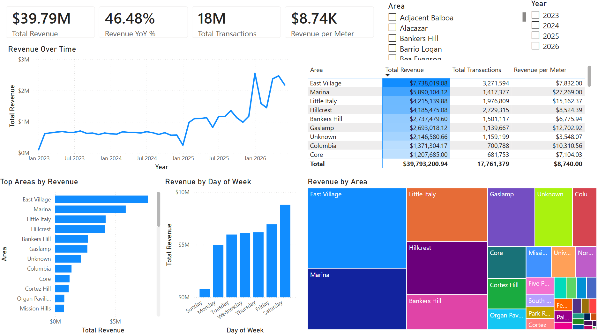

# San Diego Parking Meter Revenue Dashboard



Interactive Power BI dashboard analyzing daily parking meter revenue across
San Diego, built on public transaction and location data from the City of
San Diego Open Data Portal. The project covers the full workflow from raw
data cleaning through an interactive reporting layer.

## What This Answers

- Which zones/areas generate the most parking revenue, and how does that
  change when normalized per meter?
- How does revenue shift by season and day of week?
- Where geographically is parking demand concentrated?
- How has revenue trended year over year (2023–2026)?

## How It's Built

Data was pulled from two City of San Diego datasets: daily meter
transactions and meter locations. Each year's transaction file (2023–2026) was 
loaded into Power Query individually, where data types were corrected and 
inconsistencies cleaned, before being appended into a single fact table.
Meter location data was cleaned and joined in as a dimension table, and a 
custom date dimension table was built to support time-based analysis. 
The result is a star schema (`fact_parking_transactions` related to `dim_meter_location` 
and `dim_date`) with DAX measures handling revenue totals, year-over-year comparisons, 
and per-meter averages. The dashboard itself is built around KPI cards, a revenue trend 
line, ranked bar charts, a treemap, and a conditional-formatted table for geographic
comparison.

## Tools

- Power BI Desktop (data modeling, DAX, visuals)
- Power Query / M (data cleaning and transformation)
- Git / GitHub

## A Note on Data Cleaning

A few data quality issues worth documenting since they shaped the final model:

- **Type misdetection on `pole_id`**: Power Query auto-detected this
  field as a Date type on import, which silently corrupted the ID
  values. Fixed by removing the automatic type-conversion step and
  explicitly setting the field to text in each year's query.

- **Transaction amounts stored in cents**: A review of the source data dictionary
  showed transaction amounts were recorded in cents, not dollars.
  Fixed by dividing the revenue field by 100 across the fact table
  before finalizing.

- **Orphaned meter IDs**: some `pole_id`s present in the transaction
  data had no matching row in the meter location file, which caused
  blank values in filters and slicers. Resolved by identifying the
  unmatched IDs (via an anti-join), adding them to the location
  dimension table with an "Unknown" area/zone label, and appending
  them so every transaction has a valid dimension match.

2022 data was excluded to keep the scope manageable for this first
version of the project. The final dataset covers 2023 through mid-2026,
which is enough history for meaningful seasonal and year-over-year
comparisons.

## A Note on Visuals

Power BI's Map and Filled Map visuals were unavailable in this
environment, and Azure Maps/ArcGIS were not
viable substitutes here either. Geographic
concentration is shown instead through a treemap and a conditionally
formatted table ranked by area.

## Key Findings
- East Village, Marina, and Little Italy generate the most total
  revenue of any area. On a per-meter basis, though, the top
  performers are Organ Pavilion, the Space Theater, and South
  Carousel: all small, specific attractions within Balboa Park
  rather than full neighborhoods. A handful of meters serving heavy
  tourist foot traffic drives a high per-meter average even though
  total revenue in these areas is modest; with so few meters, these
  figures are also more sensitive to outliers than larger areas.
- Revenue rose sharply starting January 2026, nearly doubling
  from December 2025, and has trended upward overall since around
  early 2025. No consistent seasonal (recurring, cyclical) pattern
  was observed across the multi-year window; the trend reads as a
  sustained shift upward rather than a repeating cycle.
- Saturday is the highest-revenue day, with revenue climbing
  steadily from Monday through the week. Sunday is a clear outlier,
  with revenue at $0 through July 2025 before becoming a normal
  revenue day. This lines up with San Diego policy: paid Sunday
  parking was not enforced citywide until major commercial districts
  (Downtown, Uptown, Midtown, Pacific Beach) began Sunday meter
  enforcement in mid-to-late 2025. Low Sunday revenue across most of
  this dataset reflects meters not being enforced that day, not low
  actual demand.

## Limitations

- Revenue reflects paid meter transactions only — it doesn't capture
  unpaid violations, meter downtime, or actual parking occupancy
- A small number of meters have no area/zone information in the
  source location data and are labeled "Unknown" rather than dropped
- 2022 data is excluded from this version of the analysis
- 2026 data is partial (year in progress as of this analysis), so
it shouldn't be compared directly against full prior years

## Repo Contents

```
sd-parking-meter-revenue-dashboard/
├── dashboard/         # .pbix file
├── documents/         # data model diagram, data dictionary
└── README.md
```

## License

MIT

## About Me

Hi, I'm Lauren Rabin. I graduated from UC Santa Barbara in 2024 with a degree in Statistics and Data Science. Since then I've been working in healthcare where data is a big part of my day to day, and honestly it's the part I enjoy most. This project is my way of continuing to build on that and grow into a more technical data role.

Connect with me on [LinkedIn](https://www.linkedin.com/in/laurenrabin).
